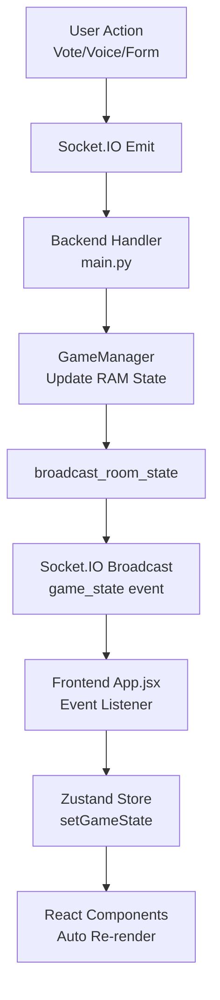

# 📚 ArenaLogic - Technical Manual

Complete technical documentation covering WebSocket architecture, voice accessibility system, AI agent implementation, and game mechanics.

---

## Table of Contents

1. [System Architecture](#system-architecture)
2. [WebSocket Communication](#websocket-communication)
   - Frontend State Updates
   - Vote Flow
   - Form Auto-Fill Flow
3. [Voice Accessibility System](#voice-accessibility-system)
4. [AI Agent Implementation](#ai-agent-implementation)
5. [Game Mechanics](#game-mechanics)
6. [API Reference](#api-reference)
7. [Deployment](#deployment)

---

## 1. System Architecture

### Overview

ArenaLogic uses a **client-server architecture** with real-time bidirectional communication via WebSocket (Socket.IO). The system is divided into three main layers:

```
┌─────────────────────────────────────────────────────────────────┐
│                        Client Layer                              │
│  ┌──────────────────┐  ┌──────────────────┐  ┌──────────────┐  │
│  │   React UI       │  │  Socket.IO       │  │  MediaRecorder│  │
│  │   (GameArena)    │  │  Client          │  │  (Voice)      │  │
│  └──────────────────┘  └──────────────────┘  └──────────────┘  │
└─────────────────────────────────────────────────────────────────┘
                              ↕ WebSocket
┌─────────────────────────────────────────────────────────────────┐
│                        Server Layer                              │
│  ┌──────────────────┐  ┌──────────────────┐  ┌──────────────┐  │
│  │   FastAPI        │  │  Socket.IO       │  │  GameManager │  │
│  │   HTTP Server    │  │  Server          │  │  (State)     │  │
│  └──────────────────┘  └──────────────────┘  └──────────────┘  │
└─────────────────────────────────────────────────────────────────┘
                              ↕
┌─────────────────────────────────────────────────────────────────┐
│                    Accessibility Layer                           │
│  ┌──────────────────┐  ┌──────────────────┐  ┌──────────────┐  │
│  │   Whisper STT    │  │  LangGraph       │  │  Edge-TTS    │  │
│  │   (Audio→Text)   │  │  AI Agent        │  │  (Text→Audio)│  │
│  └──────────────────┘  └──────────────────┘  └──────────────┘  │
└─────────────────────────────────────────────────────────────────┘
```

### Technology Stack

**Backend:**
- **FastAPI**: Async Python web framework
- **Socket.IO**: Real-time event-driven communication
- **Uvicorn**: ASGI server
- **LangGraph**: AI agent orchestration framework
- **OpenAI**: GPT-4o-mini for agent reasoning, Whisper for STT
- **Edge-TTS**: Microsoft Edge TTS for speech synthesis

**Frontend:**
- **React 19**: UI library
- **Vite**: Build tool and dev server
- **Socket.IO Client**: WebSocket client
- **Zustand**: Lightweight state management
- **Bootstrap 5**: UI components
- **Framer Motion**: Animation library

---

## 2. WebSocket Communication

### Protocol Design

ArenaLogic uses **Socket.IO** for real-time communication with automatic reconnection, fallback to HTTP long-polling, and event-based messaging.

### Connection Flow

```
┌─────────┐                                  ┌─────────┐
│ Client  │                                  │ Server  │
└────┬────┘                                  └────┬────┘
     │                                            │
     │─────────── connect ──────────────────────▶│
     │◀────────── 'connected' ───────────────────│
     │                                            │
     │───── join_game({name, avatar, room}) ────▶│
     │                                            │
     │◀──────── game_state (broadcast) ──────────│
     │                                            │
     │─────── player_input({vote: 0|1}) ────────▶│
     │                                            │
     │◀──────── game_state (updated) ────────────│
     │                                            │
```

### Event Types

#### Client → Server Events

| Event | Data | Description |
|-------|------|-------------|
| `join_game` | `{name, avatar, room_id, role}` | Join room as player/operator |
| `player_input` | `{vote: 0\|1}` | Submit vote for current round |
| `start_round` | `{duration}` | (Operator) Start new round |
| `apply_not` | `{target_sid}` | Toggle NOT gate on player |
| `toggle_accessibility` | `{room_id, target_sid}` | (Operator) Enable/disable voice for player |
| `voice_input` | `{audio: bytes, text: str, context}` | Voice command or auto-narration |
| `set_game_mode` | `{mode: str}` | Change game mode |
| `toggle_chat` | `{room_id, team_id}` | Enable/disable team chat |

#### Server → Client Events

| Event | Data | Description |
|-------|------|-------------|
| `game_state` | `{id, state, teams, round_number, ...}` | Full game state broadcast |
| `round_result` | `{winner, score, type}` | Round completion notification |
| `voice_response` | `{text, audio: base64}` | AI agent response with TTS |
| `agent_action_client` | `{action, name, avatar}` | Client-side action request |
| `error` | `{message}` | Error notification |

### State Synchronization

The server maintains authoritative game state and broadcasts updates to all clients in a room whenever state changes:

1. **Player joins** → `game_state` broadcasted to room
2. **Vote submitted** → `game_state` updated and broadcasted
3. **Round starts** → Timer begins, `game_state` broadcasted
4. **NOT gate applied** → Player flags updated, `game_state` broadcasted

**Broadcast function** (`main.py:broadcast_room_state`):
```python
async def broadcast_room_state(room_id):
    room = game_manager.rooms.get(room_id)
    if room:
        serialized_state = {
            'id': room.id,
            'state': room.state,
            'teams': {
                tid: {
                    'players': {
                        pid: {
                            'name': p.name,
                            'vote_value': p.vote_value,
                            'accessibility_enabled': p.accessibility_enabled,
                            # ... other fields
                        } for pid, p in team.players.items()
                    }
                } for tid, team in room.teams.items()
            }
        }
        await sio.emit('game_state', serialized_state, room=room_id)
```

### Frontend State Updates

ArenaLogic uses a **unidirectional data flow** pattern for UI updates: Backend (authoritative) → Socket.IO → Zustand → React Components.

#### Architecture Overview



#### Flow 1: Vote Update (UI or Voice)

**Step-by-step Example:**

1. **User Action** (GameArena.jsx):
```javascript
// Regular click
const handleVote = (value) => {
    socket?.emit('player_input', { vote: value });
};

// Or voice command: "Voto cero"
// → AccessibilityControl emits voice_input
// → Backend agent executes vote tool
```

2. **Backend Processing** (main.py):
```python
@sio.on('player_input')
async def handle_player_input(sid, data):
    vote = data.get('vote')
    room = game_manager.set_input(sid, vote)  # Updates RAM
    if room:
        await broadcast_room_state(room.id)  # Broadcasts to all
```

3. **Broadcast Function** (main.py):
```python
async def broadcast_room_state(room_id):
    room = game_manager.rooms.get(room_id)
    serialized = {
        'teams': {
            'A': {
                'players': {
                    'sid123': {'vote_value': 0, ...},  # ← Updated
                    'sid456': {'vote_value': None, ...}
                }
            }
        }
    }
    await sio.emit('game_state', serialized, room=room_id)
```

4. **Frontend Reception** (App.jsx):
```javascript
socket.on('game_state', (state) => {
    setGameState(state);  // Zustand update → triggers re-render
});
```

5. **Component Re-render** (GameArena.jsx):
```javascript
const { gameState } = useGameStore();  // Auto-subscribe

// React detects gameState change
const myPlayer = findMyPlayer(gameState);
const hasVoted = myPlayer.vote_value !== null;  // ← UI updates
```

**Complete Flow Diagram:**

```
User clicks "Vote 0"
    ↓
emit('player_input', {vote: 0})
    ↓
Backend: game_manager.set_input(sid, 0)  [RAM updated]
    ↓
broadcast_room_state(room_id)
    ↓
emit('game_state', {...}) → ALL clients in room
    ↓
App.jsx: setGameState(newState)  [Zustand updated]
    ↓
GameArena: gameState changed → React re-renders
    ↓
Vote button disabled ✅ / Vote badge shows "0" ✅
```

---

#### Flow 2: Form Auto-Fill (Voice)

**Step-by-step Example:**

1. **User Voice** (AccessibilityControl.jsx):
```javascript
// User: "Mi nombre es Elena y quiero el avatar del rayo"
socket.emit('voice_input', {
    audio: audioBlob,
    context: { view: 'LOBBY' }
});
```

2. **Backend AI Processing** (accessibility.py):
```python
async def process_command(sid, audio, context):
    # STT
    text = await self.stt(audio)  # "Mi nombre es Elena..."
    
    # LangGraph Agent
    inputs = {"messages": [HumanMessage(content=text)]}
    result = await self.agent_graph.ainvoke(inputs)
    
    # Agent executes: client_fill_form(sid, "Elena", "rayo")
    # Tool returns: {"action": "fill_form", "name": "Elena", "avatar": "⚡"}
    # ActionCaptureCallback captures this
    
    return {
        "text": "He rellenado tu nombre como Elena...",
        "audio": audio_b64,
        "client_actions": [{"action": "fill_form", "name": "Elena", "avatar": "⚡"}]
    }
```

3. **Backend Emission** (main.py):
```python
@sio.on('voice_input')
async def handle_voice_input(sid, data):
    result = await accessibility_manager.process_command(...)
    
    # Emit response
    await sio.emit('voice_response', result, to=sid)
    
    # Emit client actions
    if result.get('client_actions'):
        for action in result['client_actions']:
            await sio.emit('agent_action_client', action, to=sid)
            # ↑ {"action": "fill_form", "name": "Elena", "avatar": "⚡"}
```

4. **Frontend Reception** (App.jsx):
```javascript
socket.on('agent_action_client', (action) => {
    if (action.action === 'fill_form') {
        useGameStore.getState().setDraftProfile({
            name: action.name,      // "Elena"
            avatar: action.avatar   // "⚡"
        });
    }
});
```

5. **Component Re-render** (Lobby.jsx):
```javascript
const { draftProfile } = useGameStore();  // Auto-subscribe
const { name, avatar } = draftProfile;

return (
    <Form.Control
        value={name}  // ← Shows "Elena" immediately ✅
        onChange={(e) => setDraftProfile({ name: e.target.value })}
    />
);
```

**Complete Flow Diagram:**

```
User: "Mi nombre es Elena avatar rayo"
    ↓
emit('voice_input', {audio: blob})
    ↓
Backend: STT → "Mi nombre es Elena avatar rayo"
    ↓
LangGraph Agent → client_fill_form("Elena", "rayo")
    ↓
Tool returns: {"action": "fill_form", "name": "Elena", "avatar": "⚡"}
    ↓
ActionCaptureCallback.on_tool_end captures
    ↓
emit('agent_action_client', {action: "fill_form", ...})
    ↓
App.jsx: setDraftProfile({name: "Elena", avatar: "⚡"})
    ↓
Lobby: draftProfile changed → React re-renders
    ↓
Form inputs show "Elena" and ⚡ ✅
```

---

#### Global Event Handlers

**Location**: `App.jsx` (mounted globally, always active)

```javascript
useEffect(() => {
    if (!socket) return;

    // Main game state synchronization
    socket.on('game_state', (state) => {
        setGameState(state);
        
        // Auto-detect player info for voice join
        const myPlayerInfo = findPlayerInTeams(state.teams, socket.id);
        if (myPlayerInfo) {
            setPlayer({
                name: myPlayerInfo.name,
                avatar: myPlayerInfo.avatar,
                role: myPlayerInfo.role || 'player'
            });
            setInGame(true);
        }
    });

    // Agent client actions (form fill, navigation)
    socket.on('agent_action_client', (action) => {
        if (action.action === 'fill_form') {
            useGameStore.getState().setDraftProfile({
                name: action.name,
                avatar: action.avatar
            });
        }
    });

    return () => {
        socket.off('game_state');
        socket.off('agent_action_client');
    };
}, [socket, setGameState, setPlayer]);
```

---

#### Zustand Store Structure

**Location**: `store/gameStore.js`

```javascript
export const useGameStore = create((set) => ({
    // Game state (received from backend)
    gameState: null,
    player: null,
    
    // Draft state (form inputs before submission)
    draftProfile: { name: '', avatar: '🦁', role: 'player' },
    
    // Setters
    setGameState: (state) => set({ gameState: state }),
    setPlayer: (player) => set({ player }),
    setDraftProfile: (updates) => set((state) => ({ 
        draftProfile: { ...state.draftProfile, ...updates } 
    })),
}));
```

**Why Zustand?**
- ✅ No React Context boilerplate
- ✅ Auto-subscribes components (no manual `useEffect`)
- ✅ Can update from outside React (e.g., Socket callbacks)
- ✅ Minimal re-renders (only subscribers update)

---

#### Key Design Principles

1. **Single Source of Truth**: Backend `game_manager` RAM state is authoritative
2. **Broadcast Pattern**: All clients receive same `game_state` via Socket.IO rooms
3. **Optimistic Updates**: None (always wait for server confirmation)
4. **State Immutability**: Zustand creates new state objects → React detects changes
5. **Global Event Listeners**: Mounted in `App.jsx` to ensure availability in all views

**Why This Works:**
```javascript
// ❌ BAD: Local state (can desync)
const [votes, setVotes] = useState({});
socket.on('player_input', ...); // Maybe missed in other components

// ✅ GOOD: Centralized Zustand + Backend broadcast
socket.on('game_state', (state) => setGameState(state));
// → All components using useGameStore() auto-update
```

---

## 3. Voice Accessibility System

### Purpose

The voice accessibility system enables **visually impaired players** to:
- Join games using voice commands
- Receive automatic audio narration of game events
- Submit votes by voice
- Sabotage opponents by voice
- Query game state by voice

### Architecture

```
┌──────────────────────────────────────────────────────────────┐
│                    Frontend (Browser)                         │
│  ┌────────────────────────────────────────────────────────┐  │
│  │  AccessibilityControl.jsx                              │  │
│  │  • Push-to-talk button (Space key / Hold button)      │  │
│  │  • MediaRecorder API (audio capture)                  │  │
│  │  • Auto-narration triggers (gameState changes)        │  │
│  └────────────────────────────────────────────────────────┘  │
│                          ↓ Blob (audio/webm)                  │
└──────────────────────────┼────────────────────────────────────┘
                           │ Socket.IO (voice_input event)
┌──────────────────────────┼────────────────────────────────────┐
│                    Backend (Python)                            │
│  ┌────────────────────────┴────────────────────────────────┐  │
│  │  AccessibilityManager.process_command()                │  │
│  │  1. STT: Audio → Text (Whisper)                        │  │
│  │  2. LangGraph Agent: Text → Action + Response          │  │
│  │  3. TTS: Text → Audio (Edge-TTS)                       │  │
│  └────────────────────────┬────────────────────────────────┘  │
│                          ↓ {text, audio: base64}              │
└──────────────────────────┼────────────────────────────────────┘
                           │ Socket.IO (voice_response event)
┌──────────────────────────┼────────────────────────────────────┐
│                    Frontend (Browser)                         │
│  • Play audio response                                        │
│  • Execute client actions (e.g., navigate to game)           │
└──────────────────────────────────────────────────────────────┘
```

### Components

#### 3.1 Speech-to-Text (STT)

**Implementation**: `accessibility.py:transcribe_audio()`

Uses **Whisper** (OpenAI's speech recognition model) with automatic fallback:

```python
async def transcribe_audio(self, audio_bytes):
    try:
        # Primary: OpenAI API (if available)
        audio_file = BytesIO(audio_bytes)
        audio_file.name = "audio.webm"
        transcript = await client.audio.transcriptions.create(
            model="whisper-1",
            file=audio_file
        )
        return transcript.text
    except Exception as e:
        # Fallback: Local Whisper model
        return await self.local_whisper_transcribe(audio_bytes)
```

**Local Whisper** uses `torch` + `whisper` library for offline processing.

#### 3.2 Text-to-Speech (TTS)

**Implementation**: `accessibility.py:text_to_speech()`

Uses **Edge-TTS** (Microsoft Edge's neural TTS) for high-quality Spanish voice:

```python
async def text_to_speech(self, text: str):
    try:
        communicate = edge_tts.Communicate(text, voice="es-ES-AlvaroNeural")
        audio_chunks = []
        async for chunk in communicate.stream():
            if chunk["type"] == "audio":
                audio_chunks.append(chunk["data"])
        
        audio_data = b''.join(audio_chunks)
        return base64.b64encode(audio_data).decode('utf-8')
    except Exception as e:
        print(f"[TTS ERROR] {e}")
        return None
```

**Voice**: `es-ES-AlvaroNeural` (male Spanish voice, configurable)

#### 3.3 AI Agent (LangGraph)

**Purpose**: Understand voice commands and execute game actions.

**Tools available to the agent**:

1. **vote(sid, value)**: Submit vote (0 or 1)
2. **get_game_state(sid)**: Read current game status
3. **client_fill_form(sid, name, avatar)**: Pre-fill registration form
4. **confirm_join_game(sid, name, avatar)**: Join game and navigate
5. **apply_not_gate(sid, target_player_name)**: Sabotage rival by name

**Agent Graph**:
```python
def create_agent_graph(tools, llm):
    agent = create_react_agent(llm, tools)
    
    graph = StateGraph(MessagesState)
    graph.add_node("agent", agent)
    graph.add_node("tools", ToolNode(tools))
    
    graph.set_entry_point("agent")
    graph.add_edge("tools", "agent")
    
    # Conditional routing: if agent calls tools, execute them
    graph.add_conditional_edges("agent", should_continue)
    
    return graph.compile(checkpointer=MemorySaver())
```

**Memory**: Per-user conversation threads stored in `MemorySaver()` using `sid` as thread ID.

#### 3.4 Auto-Narration

**Frontend Implementation**: `AccessibilityControl.jsx`

Monitors `gameState` changes and triggers narration:

```javascript
useEffect(() => {
    if (!socket || !gameState || !isActive) return;
    
    const myPlayer = findMyPlayer(gameState, socket.id);
    if (!myPlayer) return;
    
    // Round start
    if (gameState.state === 'PLAYING' && 
        gameState.round_number !== lastNarratedRoundRef.current) {
        
        const teammates = getTeammates(gameState, socket.id);
        const narration = `Ronda ${gameState.round_number} iniciada. 
                          Tu puerta es ${team.current_gate}. 
                          Tu carta: ${myPlayer.card_value}. 
                          Compañeros: ${teammates.map(p => 
                            `${p.name} carta ${p.card_value}`).join(', ')}`;
        
        socket.emit('voice_input', {
            text: narration,
            isAutoNarration: true
        });
    }
    
    // NOT gate detection
    // ... similar logic
}, [gameState, socket, isActive]);
```

**Backend Filtering**: Only send to players with `accessibility_enabled = True`:

```python
# main.py:voice_input handler
is_auto_narration = data.get('isAutoNarration', False)

# Check if player has accessibility enabled
player_has_access = False
for room in game_manager.rooms.values():
    for team in room.teams.values():
        if sid in team.players:
            player_has_access = team.players[sid].accessibility_enabled
            break

# Skip if not enabled
if is_auto_narration and not player_has_access:
    return
```

### Operator Controls

The operator can enable/disable accessibility per player via **HackerDashboard**:

- **UI**: Toggle button (🔊/🔇) next to each player
- **Event**: `toggle_accessibility(room_id, target_sid)`
- **Authorization**: Only operator can toggle

```javascript
// HackerDashboard.jsx
<Button
    onClick={() => socket?.emit('toggle_accessibility', { 
        room_id: gameState.id, 
        target_sid: sid 
    })}
    variant={p.accessibility_enabled ? "success" : "outline-secondary"}
>
    {p.accessibility_enabled ? '🔊' : '🔇'}
</Button>
```

---

## 4. AI Agent Implementation

### LangGraph Architecture

**LangGraph** is a framework for building stateful, multi-actor applications with LLMs. Our agent uses a **ReAct** (Reasoning + Acting) pattern.

**Graph Structure**:
```
Entry → Agent (LLM) → [Decision]
                       ↓
                   Use Tool? ─No─→ Respond
                       ↓Yes
                   Execute Tool
                       ↓
                   Return to Agent (with tool result)
```

### Tools Implementation

Each tool is decorated with `@tool` from LangChain:

```python
@tool
def vote(sid: str, value: int):
    \"\"\"Submit a vote for the current game round.
    
    Args:
        sid: Session ID (automatically provided)
        value: The vote value, must be either 0 or 1
    \"\"\"
    try:
        room = self.game_manager.set_input(sid, value)
        if room:
            return f"Voted {value} successfully."
        return "Failed to vote. Are you in a game?"
    except Exception as e:
        return f"Error: {str(e)}"
```

### System Prompt

The agent receives a detailed system prompt with:
- Tool descriptions and usage examples
- Game context awareness
- Natural language patterns to recognize

```python
system_prompt = \"\"\"
You are a voice assistant for a logic gates game.

Current Context:
- View: {context.get('view', 'LOBBY')}
- Player in game: {in_game}

Available Tools:
1. vote(sid, value) - Submit vote
   Example: "voto uno" → call vote(sid, 1)
   
2. get_game_state(sid) - Read game status
   Example: "¿qué puerta tengo?" → call get_game_state(sid)
   
... [more tools]

IMPORTANT:
- Always respond in Spanish
- Be concise and clear
- Use tools when appropriate
\"\"\"
```

### Conversation Memory

Per-user conversation history is maintained using LangGraph's `MemorySaver`:

```python
memory = MemorySaver()
agent_executor = graph.compile(checkpointer=memory)

# Each user has their own thread
config = {"configurable": {"thread_id": sid}}
result = await agent_executor.ainvoke(
    {"messages": [HumanMessage(content=text)]},
    config
)
```

---

## 5. Game Mechanics

### Game Modes

1. **Competitive**: All teams solve the same gate
2. **Asymmetric**: Each team gets a different rotating gate
3. **Campaign**: Teams progress through a sequence of gates

### Logic Modes

1. **Predict**: Vote on expected output (0 or 1)
2. **Open**: Manipulate inputs to force output to 1

### Round Flow

```
┌─────────────────────────────────────────────────────────┐
│ 1. WAITING                                              │
│    • Operator configures settings                       │
│    • Players join teams                                 │
└────────────────┬────────────────────────────────────────┘
                 │ Operator clicks "Initiate Sequence"
┌────────────────▼────────────────────────────────────────┐
│ 2. PLAYING                                              │
│    • Cards dealt randomly to players                    │
│    • Timer starts (5-60 seconds)                        │
│    • Players submit votes                               │
│    • NOT gates can be applied (cost: -1 point)          │
│    • Logic checked when team votes complete             │
└────────────────┬────────────────────────────────────────┘
                 │ Time expires OR team solves
┌────────────────▼────────────────────────────────────────┐
│ 3. ANALYZING                                            │
│    • Calculate scores (base + bonus - penalties)        │
│    • Display results                                    │
│    • Show breakdown per team                            │
└────────────────┬────────────────────────────────────────┘
                 │ Auto-transition after 3 seconds
                 └─────────────► WAITING (next round)
```

### Scoring Formula

```python
base_score = GATE_SCORES[gate]  # 1-3 points based on difficulty
speed_bonus = 5 if solved_in_first_half else 0
sabotage_penalty = -1 * not_gates_used
survival_bonus = 0.5 if was_sabotaged and solved else 0

total_score = base_score + speed_bonus + sabotage_penalty + survival_bonus
```

---

## 6. API Reference

### Socket.IO Events

See section 2 for complete event reference.

### REST Endpoints

FastAPI serves static content and health checks:

- `GET /`: Root endpoint (health check)
- All game logic is Socket.IO based

---

## 7. Deployment

### Local Development

See README.md Quick Start section.

### Production Considerations

1. **Environment Variables**:
```bash
OPENAI_API_KEY=sk-...
PORT=5000
```

2. **CORS Configuration**:
```python
app = FastAPI()
sio = socketio.AsyncServer(
    async_mode='asgi',
    cors_allowed_origins=['https://yourdomain.com']
)
```

3. **Nginx Reverse Proxy**:
```nginx
location /socket.io/ {
    proxy_pass http://127.0.0.1:5000;
    proxy_http_version 1.1;
    proxy_set_header Upgrade $http_upgrade;
    proxy_set_header Connection "upgrade";
}
```

4. **Scaling**: Use Redis adapter for Socket.IO to support multiple server instances:
```python
import socketio
import aioredis

redis = aioredis.from_url("redis://localhost")
mgr = socketio.AsyncRedisManager('redis://localhost')
sio = socketio.AsyncServer(client_manager=mgr)
```

---

## Appendix

### Accessibility Testing Checklist

- [ ] Voice commands work without keyboard
- [ ] Auto-narration fires on all game events
- [ ] TTS audio is clear and audible
- [ ] Operator can enable/disable per player
- [ ] Agent understands Spanish variations
- [ ] No visual-only feedback (all states narrated)

### Performance Metrics

- WebSocket latency: <100ms
- Voice processing: 1-3 seconds (STT + LLM + TTS)
- Auto-narration delay: <500ms

---

**End of Manual**
